# Todolist

Welcome to the TODO App! This is a simple Android application designed to help users manage their tasks and stay organized. With features like task creation, editing, deletion, and completion tracking, this app aims to be a straightforward tool for everyday use.

## Features

- **Create Tasks**: Add new tasks with descriptions and due dates.
- **Edit Tasks**: Modify task details whenever needed.
- **Delete Tasks**: Remove tasks that are no longer needed.
- **Complete Tasks**: Mark tasks as completed to keep track of your progress.
- **Task List**: View all tasks in a list, organized by due date or status.
- **Priority**: Set task priority while creating and editing the task.

## Screenshots

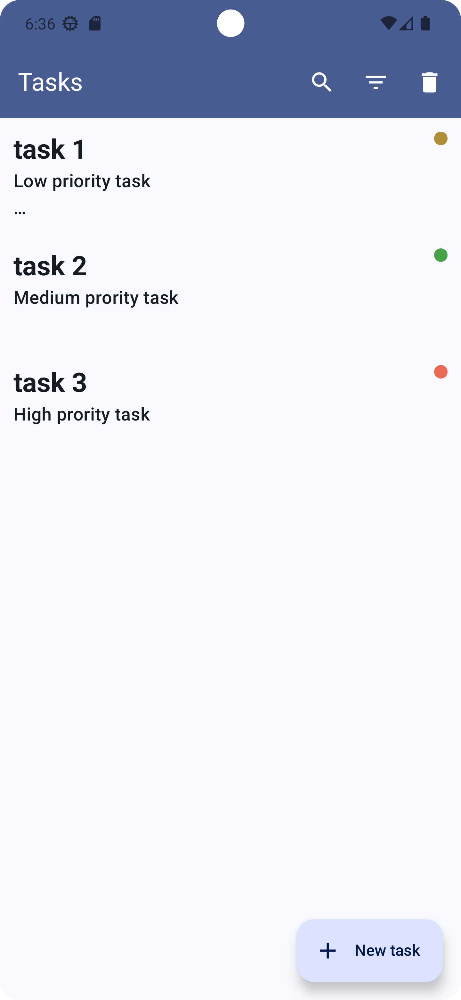
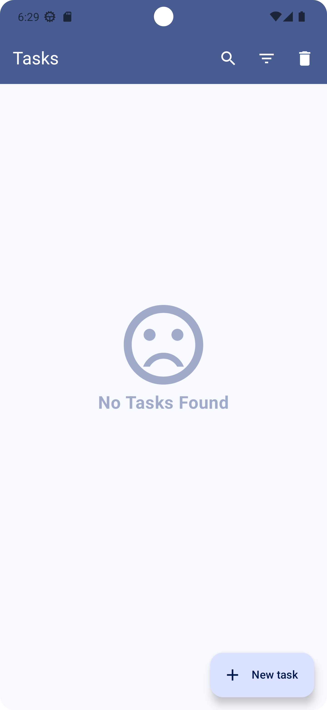
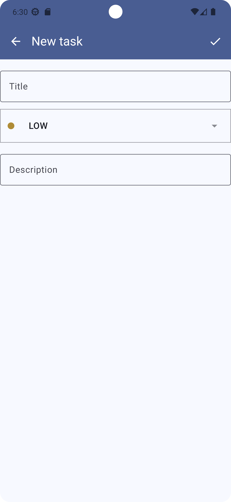
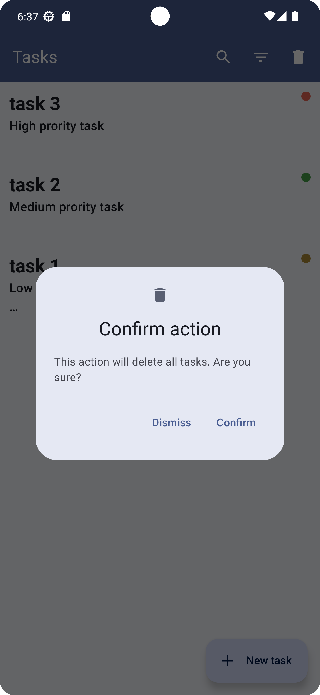
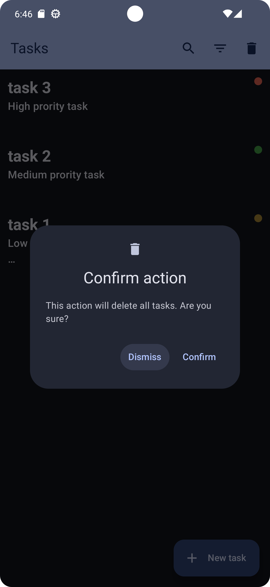
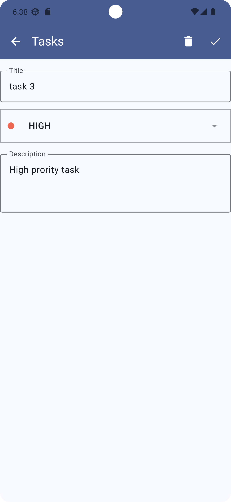
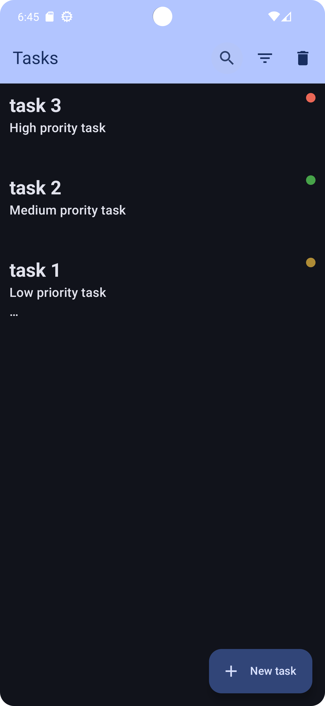
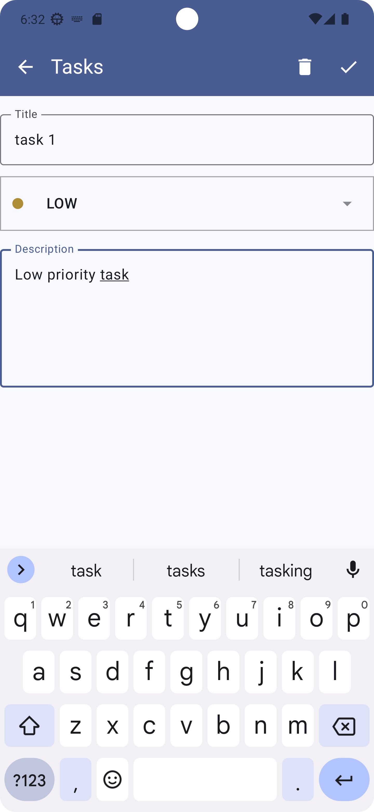
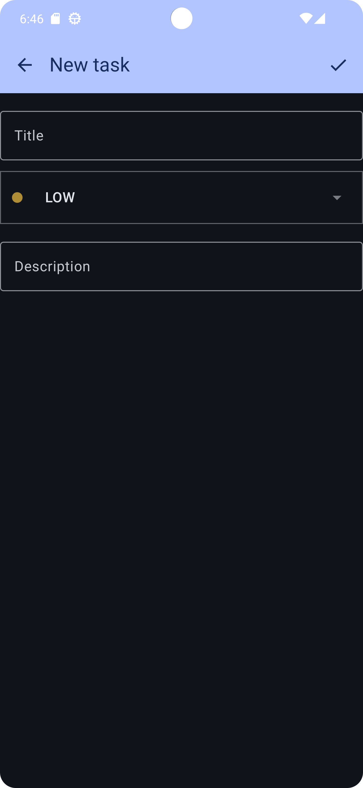
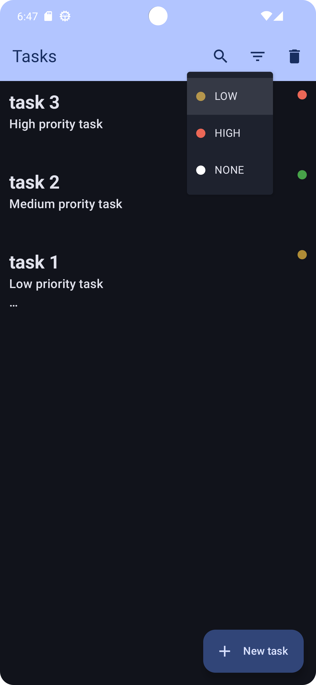
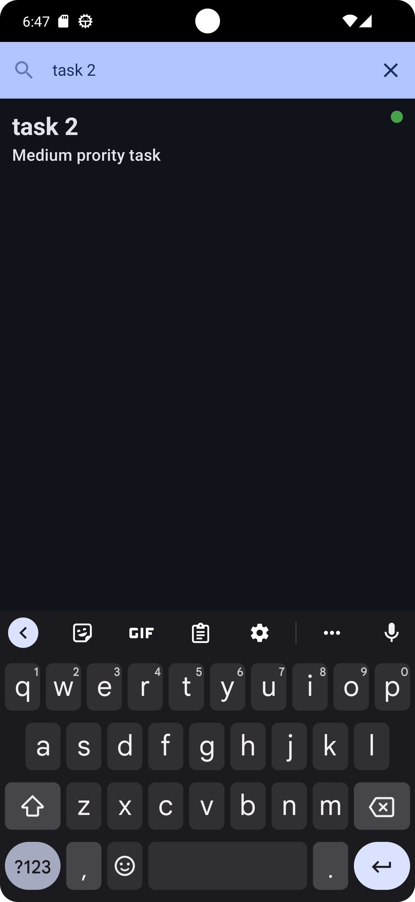
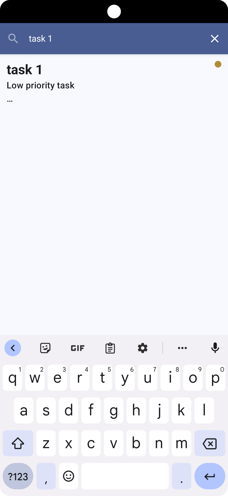
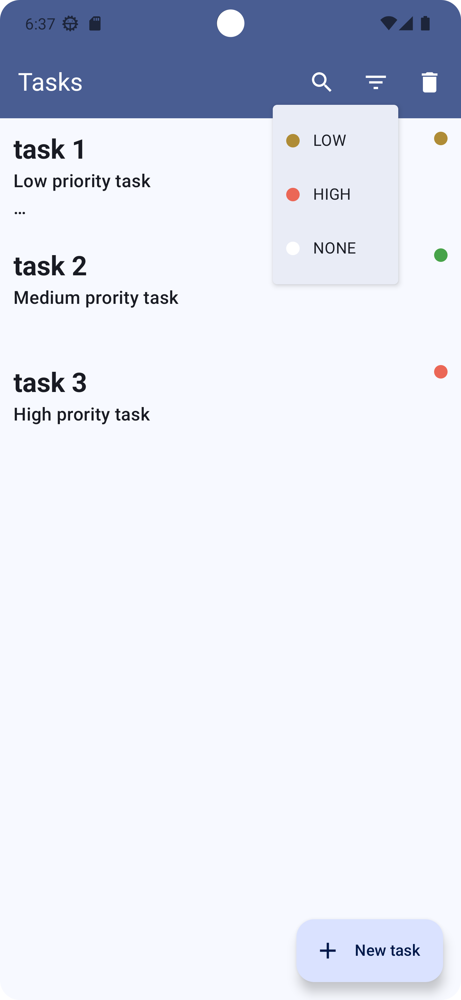
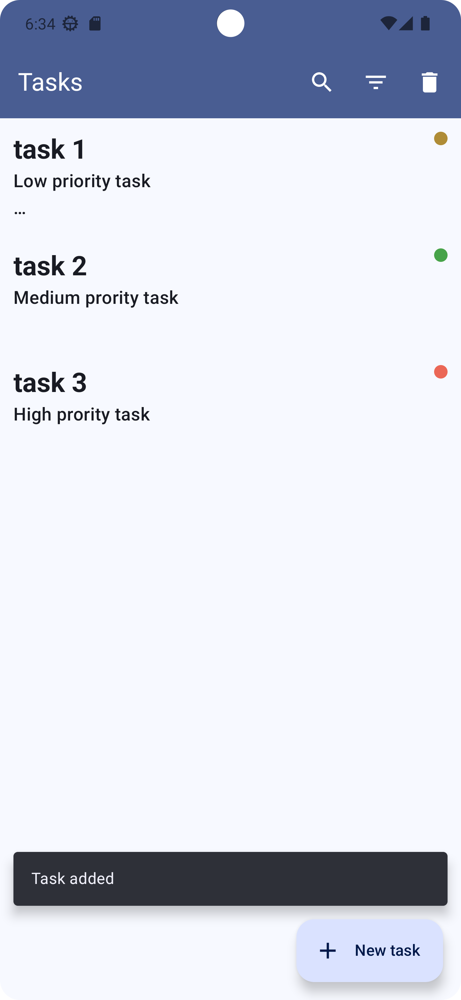
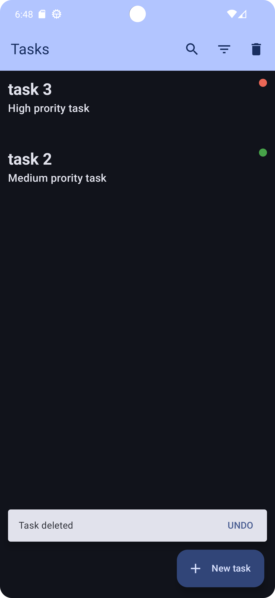
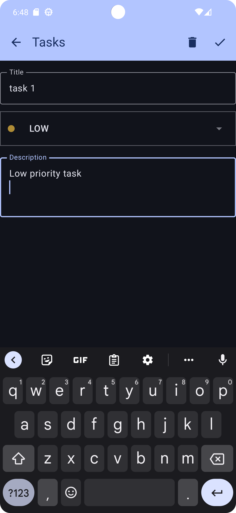
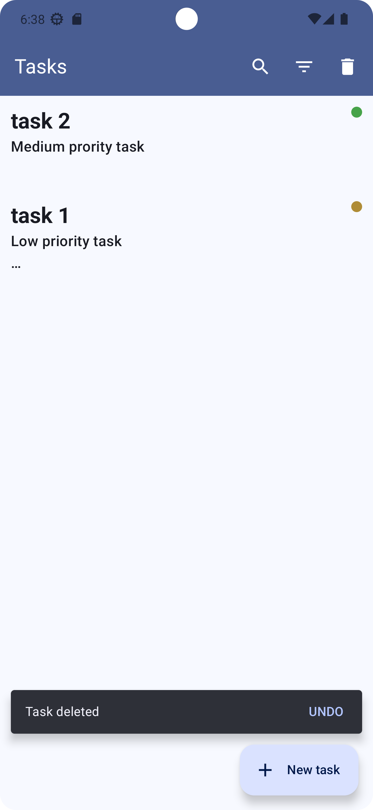


## Installation

To get started with the TODO App, follow these steps:

1. **Clone the Repository**

   ```bash
   git clone https://github.com/Venky0419/Todolist.git


### Key Points

- **Repository Information**: Includes a brief description of what the app does and its features.
- **Screenshots**: Provides visual examples of the app (you can add actual screenshots).
- **Installation Instructions**: Detailed steps to clone and run the project.
- **Usage Guide**: Instructions on how to use the app.
- **Contributing Guidelines**: How others can contribute to the project.
- **License**: Licensing information.
- **Contact Information**: How to get in touch for questions or issues.

Feel free to adjust any details to better fit your app’s specifics or your personal preferences!

